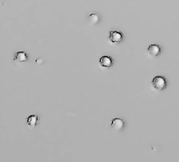

# cancerCell_Image_Enhancement_SRCNN
Super resolution convolutional neural network model was trained using A2780 cell images, which is an ovarian cancer cell. With the trained model, resolution and contrast increase were obtained. The training data were created with QuantaCell, an automatic cell counting device produced by Optofil.

# INPUT

# SRCNN OUTPUT

